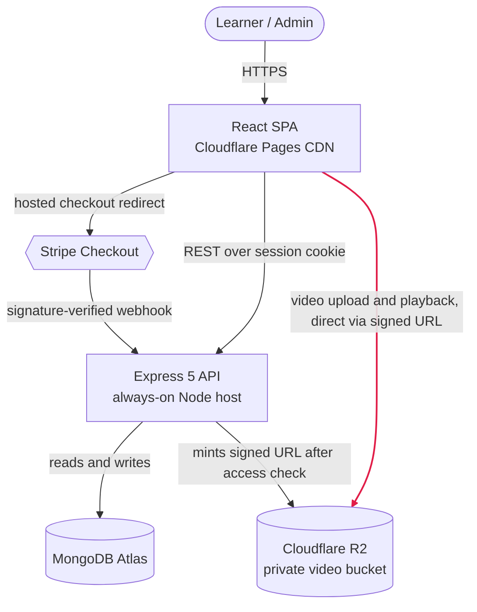

# Coursely

Coursely is a full-stack, Udemy-style learning platform. Anyone can browse and search a public
catalog, preview lessons before paying, buy a course through Stripe, and then learn in a custom
video player that saves progress and resumes exactly where they left off. Admins manage the entire
catalog from a dedicated dashboard: courses, sections, lessons, video uploads, students, and
enrollments.

It is written in TypeScript end to end (a MERN stack) and deployed as two independent packages,
with security and running cost treated as first-class design inputs rather than afterthoughts.

> **Live demo:** https://coursely-a0v.pages.dev

---

## Contents

- [Features](#features)
- [Tech stack](#tech-stack)
- [Architecture](#architecture)
- [Data model](#data-model)
- [API overview](#api-overview)
- [Security](#security)
- [Cost](#cost)
- [Testing](#testing)
- [Project structure](#project-structure)
- [Getting started](#getting-started)
- [Deployment](#deployment)
- [Roadmap](#roadmap)

---

## Features

**Browse and discover (no account needed)**

- A modern, responsive homepage with a hero, search, featured courses, and course cards with thumbnails.
- Public course pages showing the title, thumbnail, instructor, description, full curriculum, lesson
  count, a public trailer, and free preview lessons playable without signing up.
- A catalog with debounced search and category filtering.

**Accounts and access**

- Email and password signup, login, and logout, backed by server-side sessions.
- Role-based access (Student and Admin) enforced by protected client routes and server guards.

**Buy and enroll**

- Stripe hosted Checkout. Enrollment is created only by Stripe's signature-verified webhook.
- Idempotent enrollment records. A purchase can never be double-created or forged from the browser.

**Learn**

- A custom video player built over the native element, with keyboard shortcuts, speed control,
  fullscreen, resume playback, and throttled progress saving.
- A student dashboard with My Courses, Continue Learning, per-course progress, and Recently Watched.
- Completion is derived on the server (95 percent watched, and sticky once reached), so it cannot be
  faked by the client.

**Admin**

- Full course CRUD, section and lesson management, and direct-to-R2 video uploads.
- Student management (view and deactivate) and a paginated enrollments view.

**Under the hood**

- Private video storage with short-lived signed URLs. The API never proxies video bytes.
- Zod validation at every route, rate limiting, Helmet with a content security policy, and a
  cross-site CSRF guard.
- Automated quality gates: CI runs lint, typecheck, build, and tests for both packages on every push,
  plus an automated code review on every pull request and a job that triages CodeRabbit's findings.
- 46 backend and 85 frontend automated test files.

---

## Tech stack

| Layer                 | Choices                                                                                                                                                      |
| --------------------- | ------------------------------------------------------------------------------------------------------------------------------------------------------------ |
| **Frontend**          | React 19, Vite, TypeScript, TanStack Query (server state), axios, React Router, React Hook Form with zod, shadcn and Radix on Tailwind, lucide-react, sonner |
| **Backend**           | Express 5, TypeScript (Node 20), Mongoose, zod, bcryptjs, Stripe SDK, AWS S3 SDK pointed at Cloudflare R2, Helmet, express-rate-limit                     |
| **Database**          | MongoDB Atlas (managed)                                                                                                                                      |
| **Storage and video** | Cloudflare R2 (S3-compatible, private bucket, presigned URLs)                                                                                                |
| **Payments**          | Stripe (hosted Checkout and webhooks)                                                                                                                        |
| **Frontend hosting**  | Cloudflare Pages (global CDN)                                                                                                                                |
| **Backend hosting**   | Always-on managed Node host (SeeNode)                                                                                                       |
| **CI and review**     | GitHub Actions (lint, typecheck, build, test), automated code review, CodeRabbit                                                                             |
| **Testing**           | Vitest in both packages; supertest and mongodb-memory-server on the API                                                                                      |

---

## Architecture

Coursely is a monorepo of two independently deployable packages, `client/` and `server/`, that run
on separate origins. The single most important structural decision: **video never touches the
application server**. The browser uploads and streams video straight to and from a private
Cloudflare R2 bucket using per-request signed URLs, so the API stays small, cheap, and safe from
being overwhelmed by large transfers. The highlighted path below is that direct video route.



### Key design decisions

Full reasoning lives in the architecture-decision log (`docs/03-architecture.md`), with the data
model rationale in `docs/04-data-model.md`.

**Server-side sessions, not JWT**

- A signed httpOnly cookie carries only a session id backed by a Mongo TTL record, so a session can be
  revoked instantly on logout or account deactivation, and every active session is visible in one place.
  A stateless JWT cannot be reliably cancelled early.

**Payment is the single source of truth for access**

- Enrollment is created only by Stripe's signature-verified webhook (verified over the raw request body),
  and the charged amount is re-checked against a price snapshot taken at checkout. The browser's success
  page grants nothing, and the check fails closed.

**Cloudflare R2 over AWS S3**

- The dominant cost of a video platform is bandwidth out. R2 charges no egress fees, while S3 bills
  roughly 0.09 dollars per GB. R2 speaks the same S3 API, so the signed-URL tooling is identical with no
  lock-in.

**Referenced Mongo collections, not deep embedding**

- Playback, progress, and completion all act on a single lesson, so a lesson must be independently
  addressable. The `courseId` is denormalized onto lessons and progress to skip lookups on the hot paths.
  Full reasoning is in `docs/04-data-model.md`.

**Cross-site cookie with an Origin and Referer CSRF guard**

- Because the cookie is `SameSite=None; Secure` (frontend and API are on different origins), SameSite no
  longer defends against CSRF, so every state-changing request must carry an Origin or Referer matching
  the app origin, or it is rejected before any handler runs.

**Counts computed on read**

- Lesson count, total length, and the "has a trailer" flag are derived when a course loads rather than
  stored, so they can never drift out of sync.

**TanStack Query for server state**

- It fetches, caches, dedupes, and refreshes server data and tracks loading and error state, so that
  bookkeeping is not hand-written on every screen.

---

## Data model

Seven referenced collections. Money is stored as integer paise, timestamps in UTC.

| Collection    | Purpose                    | Notable constraints and indexes                                            |
| ------------- | -------------------------- | -------------------------------------------------------------------------- |
| `users`       | Accounts and role          | `email` unique; bcrypt password (not selected by default)                  |
| `sessions`    | Server-side login sessions | `expiresAt` TTL for auto-expiry; `userId` to log out everywhere            |
| `courses`     | Catalog entry              | `slug` unique; text index on title, description, and instructor for search |
| `sections`    | Curriculum groups          | `courseId`                                                                 |
| `lessons`     | Individual video lessons   | `courseId`, `sectionId`; storage key never exposed                         |
| `enrollments` | Who owns which course      | unique `{userId, courseId}`, which makes the webhook idempotent            |
| `progress`    | Per-lesson watch state     | unique `{userId, lessonId}` (upsert target); `{userId, courseId}`          |

The curriculum is a tree of `course` to `sections` to `lessons`. `enrollments` is the user-to-course
join, and `progress` is one row per user per lesson.

---

## API overview

REST under `/api`. Public endpoints need no auth. Admin endpoints are gated once at the router level
by `authenticate` and `requireAdmin`. The Stripe webhook is authenticated by signature, not a session.

### Auth

| Method | Endpoint             | Access        | Description                           |
| ------ | -------------------- | ------------- | ------------------------------------- |
| `POST` | `/api/auth/register` | Public        | Register a new student account        |
| `POST` | `/api/auth/login`    | Public        | Log in and receive the session cookie |
| `POST` | `/api/auth/logout`   | Authenticated | Destroy the current session           |
| `GET`  | `/api/auth/me`       | Authenticated | Return the authenticated user         |

### Public catalog

| Method | Endpoint                         | Access | Description                                         |
| ------ | -------------------------------- | ------ | --------------------------------------------------- |
| `GET`  | `/api/courses`                   | Public | List published courses (optional `?q=` text search) |
| `GET`  | `/api/courses/:slug`             | Public | Course detail with full curriculum                  |
| `GET`  | `/api/courses/:slug/trailer-url` | Public | Signed URL for the course trailer                   |

### Playback

| Method | Endpoint                        | Access        | Description                                                             |
| ------ | ------------------------------- | ------------- | ----------------------------------------------------------------------- |
| `GET`  | `/api/lessons/:id/playback-url` | Optional auth | Signed video URL (preview open; paid is enrollment-gated; admin bypass) |

### Payments

| Method | Endpoint                          | Access            | Description                                                     |
| ------ | --------------------------------- | ----------------- | --------------------------------------------------------------- |
| `POST` | `/api/checkout`                   | Authenticated     | Create a Stripe Checkout session (price snapshot into metadata) |
| `GET`  | `/api/checkout/:sessionId/status` | Authenticated     | Reconcile a checkout, own session only (a webhook backstop)     |
| `POST` | `/api/webhooks/stripe`            | Webhook signature | Stripe events; the sole writer of enrollment records            |

### Enrollment, learning, and progress

| Method | Endpoint                         | Access        | Description                                          |
| ------ | -------------------------------- | ------------- | ---------------------------------------------------- |
| `GET`  | `/api/enrollments/me`            | Authenticated | The caller's own enrollments                         |
| `GET`  | `/api/learning/overview`         | Authenticated | Dashboard aggregate (stats, courses, recent lessons) |
| `PUT`  | `/api/progress/:lessonId`        | Authenticated | Report the playhead position for a lesson            |
| `GET`  | `/api/progress/course/:courseId` | Authenticated | The caller's progress rows for a course              |

### Admin

All admin endpoints require `authenticate + requireAdmin`.

| Method   | Endpoint                                 | Description                                            |
| -------- | ---------------------------------------- | ------------------------------------------------------ |
| `GET`    | `/api/admin/courses`                     | List all courses (drafts and published)                |
| `GET`    | `/api/admin/courses/:id`                 | Get a course with its full curriculum                  |
| `POST`   | `/api/admin/courses`                     | Create a course                                        |
| `PATCH`  | `/api/admin/courses/:id`                 | Update a course                                        |
| `DELETE` | `/api/admin/courses/:id`                 | Delete a course (cascades to sections, lessons, media) |
| `POST`   | `/api/admin/courses/:id/trailer-url`     | Mint a signed PUT for a trailer upload                 |
| `PATCH`  | `/api/admin/courses/:id/trailer`         | Save the trailer key after upload                      |
| `POST`   | `/api/admin/courses/:courseId/sections`  | Create a section                                       |
| `PATCH`  | `/api/admin/sections/:id`                | Update a section                                       |
| `DELETE` | `/api/admin/sections/:id`                | Delete a section                                       |
| `POST`   | `/api/admin/sections/:sectionId/lessons` | Create a lesson                                        |
| `PATCH`  | `/api/admin/lessons/:id`                 | Update a lesson                                        |
| `DELETE` | `/api/admin/lessons/:id`                 | Delete a lesson                                        |
| `POST`   | `/api/admin/lessons/:id/upload-url`      | Mint a signed PUT for a lesson video                   |
| `PATCH`  | `/api/admin/lessons/:id/video`           | Save the video key and duration after upload           |
| `GET`    | `/api/admin/students`                    | List all students                                      |
| `GET`    | `/api/admin/students/:id`                | Get a student by id                                    |
| `PATCH`  | `/api/admin/students/:id`                | Update a student (for example, deactivate)             |
| `GET`    | `/api/admin/enrollments`                 | List all enrollments (paginated)                       |

---

## Security

The system was threat-modelled with STRIDE (`docs/06-security.md`). Highlights:

**Payment integrity**

- The Stripe webhook is verified over the raw request body, and an unsigned or invalid event is rejected
  before any database write. It is the only unauthenticated endpoint that writes.

**Amount tampering**

- The webhook re-checks the paid amount against a price snapshot taken at checkout, not the live price,
  so a mid-checkout re-price cannot strand a buyer and an underpaid charge is refused. A missing snapshot
  yields NaN, which never matches, so it fails closed.

**Access control**

- Every per-user query is scoped to the session's user id, never a client-supplied id, and the
  reconciliation endpoint asserts session ownership to prevent IDOR.

**Content protection**

- The R2 bucket is private, and video is reachable only through a short-lived per-request signed URL
  minted after an enrollment check. Storage keys never leave the server.

**Server-owned power fields**

- Role is forced to student at signup, and completion is derived on the server. The client can only
  report a playback position.

**Baseline**

- Zod validation at every route, bcrypt passwords, per-IP rate limiting, Helmet with an explicit content
  security policy, transactional cascade deletes, MongoDB `$jsonSchema` collection validators as a
  database-level backstop, TLS on every hop, and secrets kept in environment variables only.

---

## Cost

The dominant cost of a video platform is egress, and Cloudflare R2 charges none of it. Because the
API never proxies video bytes, it also stays small. Everything else runs on free or minimal tiers, so
the whole system runs for roughly the price of one always-on API instance.

| Service           | Role                                     | Tier      | Monthly (approx.)            |
| ----------------- | ---------------------------------------- | --------- | ---------------------------- |
| MongoDB Atlas M0  | Database                                 | Free      | $0                           |
| Cloudflare Pages  | Frontend and CDN                         | Free      | $0                           |
| Cloudflare R2     | Video storage and delivery (zero egress) | Free tier | ~$0                          |
| Managed Node host | Always-on API                            | Paid      | $3                           |
| Stripe            | Payments                                 | Test mode | $0                           |
| **Total**         |                                          |           | **about $3 per month**       |

The one paid line is deliberate. An always-on instance avoids the cold-start delay of free sleeping
tiers. The cost consciously not paid is an HLS or transcode pipeline (see [Roadmap](#roadmap)).

---

## Testing

**Backend**

- Vitest with supertest and mongodb-memory-server. 46 test files across routes, services, middlewares,
  models, and the database schema validators (auth, payments and webhook, CSRF, progress, media gating,
  and more).

**Frontend**

- Vitest with Testing Library. 85 test files across components, hooks, and pages.

**Continuous integration**

- `.github/workflows/ci.yml` runs lint, typecheck, build, and tests for both packages as two parallel
  jobs on every push and pull request.

**Automated review**

- Every pull request gets an adversarial code review from an automated agent, plus a separate job that
  triages CodeRabbit's inline findings into a single consolidated verdict. An on-demand `@claude` agent
  responds to mentions in issues and pull requests.

```bash
cd server && npm test      # backend suite
cd client && npm test      # frontend suite
```

---

## Project structure

### Client (`client/`)

```
client/
├─ index.html
├─ components.json            # shadcn config (new-york style)
├─ vite.config.ts
├─ vitest.config.ts
├─ .env.example
├─ test/                      # mirrors src/ (components, hooks, pages, ...)
└─ src/
   ├─ main.tsx                # entry
   ├─ App.tsx
   ├─ index.css               # design tokens (font-mono default, font-heading h1-h5)
   ├─ api/                    # thin axios wrappers, one per resource
   ├─ components/
   │  ├─ ui/                  # shadcn primitives (button, dialog, tabs, ...)
   │  ├─ admin/               # LessonDialog, SectionDialog, VideoUploadField, ...
   │  ├─ common/              # AppLogo, CourseCard, DataTable, Paginator, ...
   │  ├─ course/              # CurriculumAccordion, PurchaseCard, CourseTrailerMedia
   │  ├─ dashboard/           # ContinueLearningCard, OverallProgressCard, RecentlyWatched
   │  ├─ home/                # HeroSection, FeaturedCourses, HowItWorks, ...
   │  ├─ layout/              # home/ + store/ + AdminLayout
   │  ├─ learn/               # CurriculumSidebar, CurriculumLessonRow, LessonStateIcon
   │  ├─ media/               # VideoPlayer, VideoSurface
   │  └─ sidebar/, theme/, form/
   ├─ config/                 # axiosClient, queryClient (TanStack Query)
   ├─ hooks/                  # useAuth, useCourses, useVideoControls, useVideoUpload, ...
   ├─ lib/                    # currency, date, queryKeys, playerHelpers, utils, ...
   ├─ pages/                  # Home, Catalog, CourseDetail, Learn, Dashboard, ...
   │  └─ admin/               # Overview, Courses, CourseForm, Curriculum, Students, ...
   ├─ routes/                 # AppRoutes + Protected/Guest/Admin guards + paths
   ├─ schemas/                # zod form schemas
   └─ types/                  # *Payload domain types
```

### Server (`server/`)

```
server/
├─ server.ts                  # entry: boots the app and DB connection
├─ tsup.config.ts             # bundler (build to dist/)
├─ vitest.config.ts
├─ .env.example
├─ test/                      # mirrors src/ (routes, services, models, schemas, ...)
└─ src/
   ├─ app.ts                  # Express app: helmet, cors, cookies, rate limit, CSRF, routes
   ├─ constants/              # env, httpStatus, appErrorCode
   ├─ controllers/            # request handlers (*Handler), one per resource
   ├─ database/               # mongoDB connection
   ├─ errors/                 # AppError
   ├─ lib/                    # r2 (Cloudflare R2 S3 client), stripe
   ├─ middlewares/            # auth, authorize, validate, csrf, rateLimit, error
   ├─ models/                 # 7 Mongoose models (user, course, section, lesson, ...)
   ├─ routes/                 # routers per resource + index + admin aggregator
   ├─ schemas/                # MongoDB $jsonSchema validators + validateSchema applier
   ├─ scripts/                # seedAdmin (create or promote an admin)
   ├─ services/               # business logic, one per resource
   ├─ types/                  # express request augmentation
   ├─ utils/                  # cookies, date, slug
   └─ validators/             # zod request schemas
```

---

## Getting started

### Prerequisites

- Node.js 20.11 or newer
- A MongoDB database (a local instance or MongoDB Atlas)
- A Cloudflare R2 bucket with API credentials
- A Stripe account with test-mode API keys

### 1. Clone the repository

```bash
git clone https://github.com/SrjAdhikari/coursely.git
cd coursely
```

### 2. Configure environment variables

Create `server/.env` for the API:

| Variable                | Purpose                                                                              |
| ----------------------- | ------------------------------------------------------------------------------------ |
| `NODE_ENV`              | `development` or `production` (controls the cookie's Secure and SameSite attributes) |
| `PORT`                  | API port (for example, `8080`)                                                       |
| `MONGODB_URI`           | MongoDB connection string                                                            |
| `COOKIE_SECRET`         | Secret used to sign the session cookie                                               |
| `APP_ORIGIN`            | Exact frontend origin, used by the CORS allowlist and the CSRF origin check          |
| `R2_ACCOUNT_ID`         | Cloudflare R2 account id                                                             |
| `R2_ACCESS_KEY_ID`      | Cloudflare R2 access key id                                                          |
| `R2_SECRET_ACCESS_KEY`  | Cloudflare R2 secret access key                                                      |
| `R2_BUCKET`             | Cloudflare R2 bucket name                                                            |
| `STRIPE_SECRET_KEY`     | Stripe secret key                                                                    |
| `STRIPE_WEBHOOK_SECRET` | Stripe webhook signing secret                                                        |

Create `client/.env` for the web app:

| Variable       | Purpose                                                      |
| -------------- | ------------------------------------------------------------ |
| `VITE_API_URL` | Base URL of the API, for example `http://localhost:8080/api` |

### 3. Set up the API (server)

```bash
cd server
npm install
npm run dev
```

The API runs at `http://localhost:8080` by default.

### 4. Set up the web app (client)

In a second terminal:

```bash
cd client
npm install
npm run dev
```

The app runs at `http://localhost:5173`, Vite's default port.

### 5. Create an admin account

Signup only ever creates students. Create (or promote) an admin with the seed script:

```bash
cd server
npm run seed:admin -- --email=admin@example.com --password=StrongPass123
```

If a user with that email already exists, the script promotes it to admin instead of creating a
duplicate.

### 6. Run the tests

```bash
cd server && npm test
cd client && npm test
```

### 7. Apply the database schema validators (optional)

MongoDB `$jsonSchema` collection validators live in `server/src/schemas/`. To attach them to the
database as a defense-in-depth layer, point `MONGODB_URI` at the target cluster and run:

```bash
cd server && npm run schema:apply
```

---

## Deployment

**Frontend on Cloudflare Pages**

- Builds `client/` and serves the SPA over the CDN. Set `VITE_API_URL`.

**API on an always-on managed Node host**

- Builds `server/` and runs Express. Set every server variable listed under Getting started. `APP_ORIGIN`
must exactly match the deployed frontend origin, or authenticated calls are blocked by CORS and the
CSRF guard.

**Database on MongoDB Atlas**

- Network access and the database user are scoped to the API.

**Storage on Cloudflare R2**

- A private bucket with a CORS rule allowing the frontend origin for direct uploads.

**Payments on Stripe**

- Register the webhook endpoint (`/api/webhooks/stripe`) and set its signing secret on the API host.

---

## Roadmap

Version 1 serves plain MP4 from R2 behind signed URLs, which satisfies every core video requirement
without the cost and complexity of transcoding. Deliberately deferred for later: HLS and adaptive
streaming, a multi-quality FFmpeg pipeline, picture-in-picture, and subtitles.
