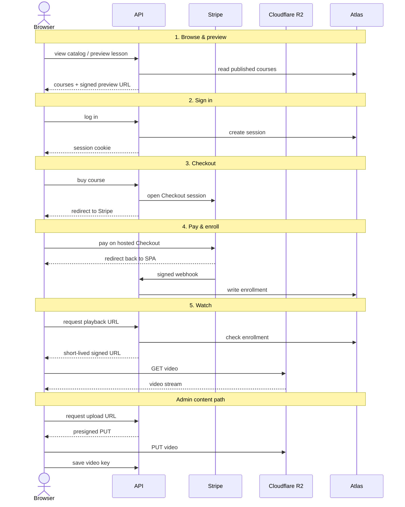
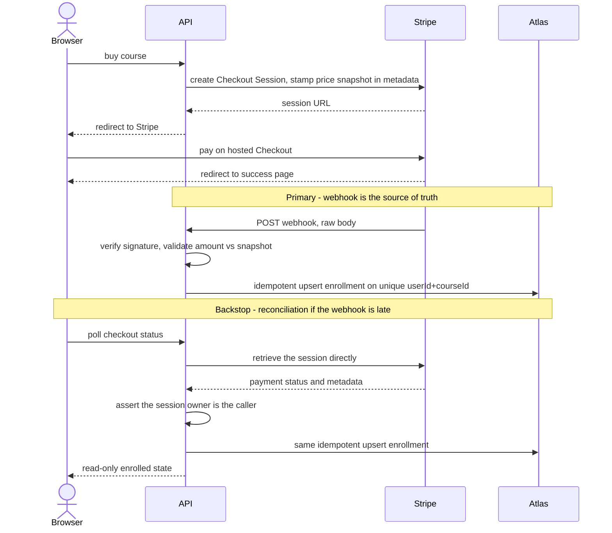

# 03 - Architecture

Anchored to arc42 (lightweight). This doc captures and justifies the stack.

## 1. Goals & Constraints

Deliver the requirements in `02` under two standing priorities: favor managed services over
self-managed infrastructure, and keep every layer straightforward to reason about. These
priorities push consistently toward **managed services over self-managed infra** and
**direct-to-storage video transfer** (bytes never touch the API).

## 2. System Context

Actors and external systems the platform talks to:

- **Student / Admin (browser)** - the only human actors.
- **Stripe** - hosted Checkout + webhooks; handles card data (we never see it).
- **Cloudflare R2** - object storage for video; receives direct browser uploads and
  serves video via signed URLs.
- **MongoDB Atlas** - application database.

The primary journey (browse, buy, watch) runs through those players in five ordered steps.
The two integrity-critical flows (auth and purchase) are detailed in §5.

1. **Browse & preview** - Browser → API → Atlas : public catalog reads; free preview lessons play with no login.
2. **Sign in** - Browser → API : the API verifies the password and sets a session cookie.
3. **Checkout** - Browser → API → Stripe : the API opens a Stripe Checkout session; the browser redirects to Stripe's hosted page.
4. **Pay & enroll** - Stripe → API → Atlas : Stripe redirects the browser back to the SPA and, separately, POSTs a signature-verified webhook that writes the enrollment.
5. **Watch** - Browser → API → R2 : the API checks enrollment and mints a short-lived signed URL; the browser streams the video straight from R2.

**Admin content path** - Browser → API → R2 : the API hands back a one-time upload link, the browser uploads the file straight to R2, and the API records only its storage key.

Video bytes always move **browser ⇄ R2 directly** (steps 5 and the admin path) - the API only mints signed URLs and stores object keys, never the media itself.

## 3. Solution Strategy (the stack & why)

| Concern        | Decision                                                                                                                  | Why this, not the alternative                                                                                                                                                                                                                                                                                             |
| -------------- | ------------------------------------------------------------------------------------------------------------------------- | ------------------------------------------------------------------------------------------------------------------------------------------------------------------------------------------------------------------------------------------------------------------------------------------------------------------------- |
| Frontend       | React 19 + Vite + **TypeScript** · Tailwind + **shadcn/ui** · **TanStack Query** + axios, hosted on a **static/CDN host** | CDN-served SPA; no SSR need for a small catalog.                                                                                                                                                                                                                                                                          |
| API            | **Express 5 + TypeScript** on a **managed host** (always-on); **zod** validation                                          | Stateless API moves no video → a managed platform spares us server hardening and upkeep. A server we run ourselves was rejected: nothing heavy runs on it, so it would only add upkeep and security risk. A cheaper tier that sleeps when idle was rejected: the first visitor after it sleeps waits for it to wake, which feels slow. |
| Database       | **MongoDB Atlas M0**                                                                                                      | Natural for MERN; the document model fits course→section→lesson nesting; the M0 tier suffices at launch scale.                                                                                                                                                                                                            |
| Auth           | **Server-side sessions** - custom `Session` collection (signed cookie carries a random session token; Mongo TTL), bcrypt       | Instantly revocable (logout / deactivate) - JWT can't revoke before expiry without a denylist (the state JWT was meant to avoid). A hand-rolled session layer (not `express-session`) is auditable line-by-line and reuses Atlas → no Redis, one fewer moving part.                                                       |
| Payments       | **Stripe Checkout** (test) + webhook                                                                                      | Hosted Checkout minimizes PCI surface; enrollment created only on signature-verified webhook, never on client redirect.                                                                                                                                                                                                   |
| Video storage  | **Cloudflare R2**                                                                                                         | R2 exposes an S3-compatible API, so the browser transfers video directly via presigned PUT/GET and the API never proxies bytes. Key storage decision.                                                                                                                                                                     |
| Video transfer | Browser ⇄ R2 via **presigned PUT/GET**                                                                                    | API never proxies video bytes → no media bandwidth or compute on the server; the API scales independently of media volume.                                                                                                                                                                                                |
| Repo           | **Monorepo** (`/client`, `/server`)                                                                                       | One repo; single source of truth; the static host builds `/client`, the managed host builds `/server`.                                                                                                                                                                                                                    |

## 4. Building Blocks

- **`/client`** - Vite React SPA: public pages (home, course), auth pages, student
  dashboard, admin dashboard, video player. Talks to the API with `fetch(credentials:
'include')`.
- **`/server`** - Express API in layers: `routes → controllers → services → models`.
  - _Auth module_ - signup/login/logout, session middleware, `requireAuth` /
    `requireAdmin` guards.
  - _Catalog module_ - courses, sections, lessons (public reads, admin writes);
    `lessonCount`/`totalDuration` are tallied on read. The public homepage hero stats
    derive from the published-courses API - course count, Σ `lessonCount`, and
    Σ `totalDuration` in whole hours.
  - _Payment module_ - create Checkout session, webhook handler, enrollment writes.
  - _Media module_ - mint presigned PUT (admin) and presigned GET (gated on enrollment).
  - _Progress module_ - record playback position; completion is derived server-side.
  - _Learning module_ - aggregates the caller's enrollments + progress into
    `GET /api/learning/overview` (`{ stats, courses, recentLessons }`), powering the
    student dashboard and My Courses.
- **Atlas** - collections defined in `04-data-model`.
- **R2 bucket** - private; objects keyed `lessons/{lessonId}/source.mp4`; no public access.

## 5. Runtime View (key flows)

**Auth.** Login verifies the bcrypt hash → creates a `Session` document in Mongo (TTL) → sets
the signed session cookie with a **fresh random token each login** (prevents fixation). Subsequent
API calls carry the cookie; middleware loads the session, checks expiry/`isActive`, and attaches
`req.user` (+ role). Logout deletes the session document.

**Purchase → enrollment (the integrity-critical flow).**

1. Student clicks Buy → API (auth required) creates a Stripe Checkout Session for that
   course's price, **stamping the expected amount + currency into the session metadata** (a
   price snapshot) → returns the URL → browser redirects to Stripe.
2. Student pays on Stripe → Stripe redirects back to the client success page.
3. **Independently**, Stripe POSTs `checkout.session.completed` to the API webhook (mounted with
   a **raw-body parser above `express.json`** so the signature can be verified) → API verifies the
   signature, validates the paid amount/currency against **that metadata snapshot** (not the live
   course - a mid-checkout price change must not fail a buyer who already paid), then records the
   `enrollment`.
4. **Reconciliation backstop.** If the webhook is delayed, the success page polls
   `GET /api/checkout/:sessionId/status`, which asks Stripe directly (never trusting a browser
   "I paid") and records the same enrollment. Both paths funnel through one recorder and an
   same **create-only-if-missing write** on the unique `{userId, courseId}` index, so even if the
   webhook and the fallback run at the same instant they can neither enroll twice nor overwrite
   the recorded payment. The
   client success page only _reads_ enrollment state; it never creates it.

**Video playback.**

1. Student opens a lesson → client asks API for a playback URL (`optionalAuth` - a
   session is used if present but is not required).
2. API resolves visibility first: a **draft/unpublished** course returns `404` to
   non-admins (no existence leak). On a **published** course, a **preview** lesson mints a
   signed GET even for a **logged-out** visitor; a paid lesson requires auth **then**
   enrollment (`401` → `403`); admins bypass. The signed GET is **~1 h TTL**, per request.
3. Player streams from R2 via that URL; posts `{ positionSeconds }` ~every 10-15s to the
   progress endpoint. **Completion is derived server-side at ≥95% and is sticky** - the
   client cannot self-declare `completed`, and once set it never un-completes.

**Admin video upload.** Admin requests an upload URL → API (admin-only) mints a presigned
PUT for `lessons/{id}/source.mp4` → browser PUTs the file straight to R2 → notifies API,
which stores the object key on the lesson.

## 6. Deployment View

- The **static host** builds `/client`, serves the SPA over a CDN. Env: API base URL.
- The **managed host** (Singapore region) builds `/server`, runs the Express API; does not sleep (paid).
  Env: Mongo URI, cookie-signing secret, Stripe secret + webhook secret, R2 credentials,
  allowed CORS origin.
- **Atlas M0** - managed Mongo; network access + DB user scoped to the API.
- **R2** - private bucket; API holds scoped access keys.
- **Stripe** - test-mode keys; webhook endpoint registered to the API host URL.

## 7. Cross-Cutting Concepts

- **Authentication & cookie transport:** the client and API are served from **independent
  origins** (separate hosts), so requests between them are **cross-site**. The signed session
  cookie is therefore `httpOnly + Secure + SameSite=None` (**host-only** - no `Domain`
  attribute, so it is scoped to the API host and unreadable by any other app), which is what
  lets the browser send it on the frontend's cross-origin `fetch`. CORS is locked to the single
  frontend origin with `credentials: true`. **Cookie attributes by environment:** prod is
  `httpOnly + Secure + SameSite=None`, host-only; local dev is same-origin over
  `http://localhost`, so it omits `Secure` and uses `SameSite=Lax`. Because the cookie is
  cross-site, `SameSite` no longer defends CSRF - an `Origin`/`Referer` guard on mutations does
  (see the CSRF note below and `06 §3`).
- **R2 CORS:** the bucket carries a CORS rule allowing the frontend origin for the admin's direct
  presigned **PUT** upload (an XHR, subject to CORS); plain `<video>` GET playback is not subject
  to CORS, so signed-URL delivery needs no rule.
- **CSRF:** because the session cookie is `SameSite=None` (cross-site origins), `SameSite`
  is **not** the CSRF control. The primary defense is an `Origin`/`Referer` guard on every
  mutating route (`verifyRequestOrigin`), rejecting requests whose origin isn't the known
  frontend with `403 CSRF_ORIGIN_MISMATCH`. Detailed in `06-security §3`. No CSRF token.
- **Authorization:** role-based only (`requireAdmin`); no per-resource ownership (single
  platform-owner Admin per `01`).
- **Config & secrets:** all secrets via environment only; never in the repo or client
  bundle (NFR-5).
- **Validation & errors:** schema validation at the route boundary; consistent JSON error
  shape; never leak stack traces or secret-bearing messages to the client.

## 8. Architecture Decisions (log)

The big, hard-to-reverse choices - each as **what we chose, why, and what we turned down.**
The deepest or later-changed ones graduate to full ADRs.

### AD-1 / AD-4 - Store and move video through Cloudflare R2, straight from the browser

- **Choice.** Videos live in a private storage bucket (Cloudflare R2). The browser uploads and plays them **directly** to and from that bucket, so the video files never pass through our own server.
- **Why.** Video is by far the heaviest thing to move. Keeping it off our single server means we don't pay to pipe it through, and a flood of large uploads can't exhaust the server. R2 also doesn't charge to send data out.
- **Alternative rejected.** Passing every upload and download through our own server - expensive on bandwidth, and an easy way for large transfers to overwhelm it.

### AD-2 - Keep login sessions on the server instead of using JWT tokens

- **Choice.** Each logged-in user gets a random session ID that points to a record in our own database, rather than a self-contained token (a JWT).
- **Why.** We can cancel a session **instantly** - on logout, or when an admin disables an account - and we can see every active session in one place. Both matter for a security-first app.
- **Alternative rejected.** JWT tokens - you can't reliably cancel one before it expires without extra machinery that undoes the very reason people use them.

### AD-5 - Course access is created only by the confirmed payment message

- **Choice.** Only Stripe's confirmed, signed payment message creates a course-access record (see `05 §3`).
- **Why.** It makes payment the single source of truth for who has access - the browser can't fake it.
- **Alternative rejected.** Granting access from the browser's "thank you" page - easy to fake.

### AD-6 - The website and API run on separate addresses, so an extra check guards changes

- **Choice.** The website and the API live on different hosts. Because of that, the login cookie is set so the browser will send it across those two addresses, and a separate check - the request must come _from our own website_ - is our main defence against cross-site request forgery (CSRF).
- **Why.** When a cookie is allowed to travel between two different sites, the browser setting that would normally block CSRF no longer helps - so we check where each change-request came from instead (see `06 §3`). The cookie is also locked to the API's own address so no other site can read it.
- **Alternative rejected.** Putting the website and API under one shared domain to avoid all this - but that would need a custom domain wired up, which the hosting platforms don't give us by default. _(This reverses our original same-site plan; a full ADR will record the change.)_

### AD-7 - Count lessons and length when a course is read, not stored on the course

- **Choice.** A course's lesson count, total length, and "has a trailer?" flag are worked out when the course is loaded, rather than saved onto the course record.
- **Why.** Nothing has to be kept in sync as lessons change, so these numbers can never go stale - and a simple loop over the lessons is easier to read than a fancier database query, at our size.
- **Alternative rejected.** Saving those numbers on the course (they'd drift out of date and need upkeep) or using a heavier database query (harder to read for no real gain).

### AD-8 - TanStack Query for server data

- **Choice.** Fetch and cache all server data with TanStack Query (React Query); axios does the actual HTTP calls.
- **Why.** Almost all the data a page shows is just a copy of what's on the server. TanStack Query keeps that copy for us - it fetches the data, remembers it, skips repeat requests for the same thing, quietly refreshes it in the background, and tracks whether each request is still loading or has failed - so we don't write that bookkeeping by hand on every screen.
- **Alternative rejected.** Doing it all by hand with `fetch` in each screen (repetitive, and easy to show stale data or trip over overlapping requests), or a general-purpose data store like Redux (built for a different job and far more than this needs).

### AD-9 - Cloudflare R2 over AWS S3

- **Choice.** Store the videos in Cloudflare R2 rather than AWS S3.
- **Why.** The biggest cost of serving video is bandwidth out, and R2 charges **no egress fees** at all, while S3 bills for every gigabyte downloaded. R2 also speaks the same S3 API, so the presigned-URL tooling is identical and there is no lock-in - we get S3's interface without S3's egress bill.
- **Alternative rejected.** AWS S3 - functionally equivalent and just as easy to wire up, but its per-gigabyte egress charges make video delivery expensive as soon as real traffic arrives.

## 9. Risks

- **CSRF** - the session cookie is `SameSite=None` (cross-site origins), so an
  `Origin`/`Referer` guard on mutating routes is the primary defense (AD-6, `06 §3`), not
  `SameSite`.
- **R2/Stripe credential leakage** - mitigated by env-only secrets + scoped keys.
- **Single API instance** - acceptable at launch scale; no HA target in v1.
