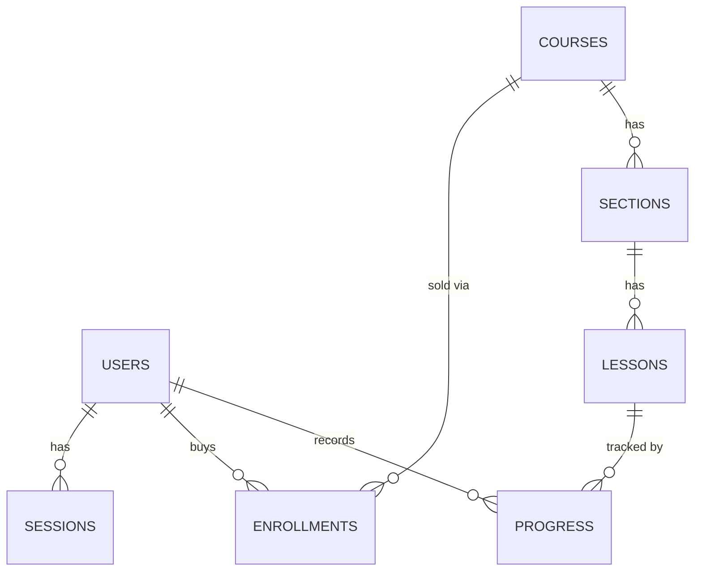

# 04 - Data Model

Conceptual → logical → physical for MongoDB (Atlas). Seven collections, **referenced**
(not embedded), chosen so lessons are first-class documents that progress and signed-URL
playback can address by `_id`.

> **Implementation note.** One clarification on the running system: the login cookie carries a
> **random token**, not the session's `_id`. The `sessions` collection stores only a hashed copy of
> that token (`tokenHash`) — never the token itself. The live `users` /
> `sessions` / `courses` / `sections` / `lessons` / `enrollments` / `progress` shapes match the
> Mongoose models documented in
> [`architecture/database-schema.md`](./architecture/database-schema.md).

## 1. Modeling Approach

Reference over embed for the course→section→lesson tree. Rationale: the hottest
operations (playback authorization, progress writes, completion calc) all act on a
**single lesson**, so a lesson must be an independently addressable document. Embedding
would force array-digging inside a course doc on every playback. The curriculum view
(course page) is still a single indexed query per collection. Money is stored as integer
**paise** to avoid floating-point errors; timestamps are UTC.

## 2. Collections

### users

| Field | Type | Notes |
|---|---|---|
| `_id` | ObjectId | |
| `name` | string | |
| `email` | string | **unique**, lowercased |
| `password` | string | bcrypt-hashed in a pre-save hook; `select:false`; plaintext never stored (FR-6) |
| `role` | enum `student\|admin` | default `student`; authorization source (FR-9) |
| `isActive` | boolean | default `true`; `false` blocks login (FR-22) |
| `createdAt` / `updatedAt` | Date | |

### sessions

| Field | Type | Notes |
|---|---|---|
| `_id` | ObjectId | internal only - **never** sent to the browser |
| `userId` | ObjectId → users | session owner |
| `tokenHash` | string | **unique** - a hashed copy of the random token in the cookie; login looks the session up by this, so the real token is never stored |
| `expiresAt` | Date | **TTL index** - Mongo auto-expires the row; logout deletes it explicitly |
| `createdAt` | Date | |

Custom session store (not `express-session`): one document per active login. The cookie carries a
random token; the server keeps only its hash and finds the session by that hash. A fresh token is
issued on each login (session-fixation defense, `06`).

### courses

| Field | Type | Notes |
|---|---|---|
| `_id` | ObjectId | |
| `title` | string | |
| `slug` | string | **unique**; `slugify(title)` + short collision suffix; used in public course URL |
| `description` | string | |
| `category` | string | free-text label (1-60 chars), **required on create** (API validator); no fixed enum |
| `learningOutcomes` | string[] | "what you'll learn" bullets; default `[]` |
| `instructorName` | string | display string only - no instructor *role* exists |
| `thumbnailUrl` | string | image URL |
| `trailerKey` | string? | R2 object key `courses/{_id}/trailer.mp4` for the intro/trailer (FR-3); private - served via an **ungated** signed GET, never a public URL |
| `price` | int | **paise** (₹499 → `49900`) |
| `currency` | string | `INR` |
| `isPublished` | boolean | drafts hidden from public listing |
| `createdAt` / `updatedAt` | Date | |

> **Computed on read.** `lessonCount` / `totalDuration` are **not stored** on the course - they're
> tallied from the `lessons` collection at read time. Course detail additionally returns a computed
> `hasTrailer` boolean (derived from whether `trailerKey` is set, which is itself never exposed).

### sections

| Field | Type | Notes |
|---|---|---|
| `_id` | ObjectId | |
| `courseId` | ObjectId → courses | |
| `title` | string | |
| `order` | int | sort within course |

### lessons

| Field | Type | Notes |
|---|---|---|
| `_id` | ObjectId | the unit progress & playback key off |
| `sectionId` | ObjectId → sections | |
| `courseId` | ObjectId → courses | **denormalized** - avoids lesson→section→course lookup on every playback/progress op (Q2) |
| `title` | string | |
| `order` | int | sort within section |
| `isPreview` | boolean | `true` → playable without enrollment (FR-4) |
| `videoKey` | string | R2 object key `lessons/{_id}/source.mp4`; never a public URL |
| `duration` | int | seconds; denominator for the ≥95%-complete calc (FR-16) |

### enrollments

| Field | Type | Notes |
|---|---|---|
| `_id` | ObjectId | |
| `userId` | ObjectId → users | |
| `courseId` | ObjectId → courses | |
| `stripeSessionId` | string? | Checkout session that paid for it (audit trail) |
| `amountPaid` | int? | **actual paise charged** (`session.amount_total`) - not the course's list price |
| `currency` | string? | **actual charge currency**, uppercased (`session.currency`); validated against the checkout-time price snapshot, not the live course (NFR-2) |
| `createdAt` | Date | purchase time; **no `updatedAt`** - an enrollment is written once, never mutated |

> **Write path.** An enrollment is created by an idempotent `findOneAndUpdate` upsert with
> `$setOnInsert` - a **single-document write, not a transaction**. The payment fields are stamped
> only on first insert, so a concurrent webhook + reconciliation race is a harmless no-op re-read
> and can never clobber the recorded charge; the unique `{userId, courseId}` index is the hard
> guarantee (one enrollment per pair), and an E11000 collision on a simultaneous insert is caught
> and re-read.

### progress

| Field | Type | Notes |
|---|---|---|
| `_id` | ObjectId | |
| `userId` | ObjectId → users | |
| `lessonId` | ObjectId → lessons | |
| `courseId` | ObjectId → courses | **denormalized, server-set** - never client-supplied; lets the learning overview aggregate progress per course in one query |
| `positionSeconds` | int | last playback position; resume point (FR-15); default `0`, min `0` |
| `completed` | boolean | **server-derived**, never client-set; `true` at **≥95%** watched (`positionSeconds / lesson.duration >= 0.95`); **sticky** - once `true` it never un-completes (FR-16) |
| `completedAt` | Date? | stamped **once**, on the first `false`→`true` transition |
| `createdAt` / `updatedAt` | Date | `updatedAt` powers "recently watched" sort (FR-18) |

## 3. Relationships

- `course` 1-N `section` 1-N `lesson` (referenced by `courseId` / `sectionId`).
- `user` N-N `course` via `enrollment` (the join collection).
- `user` × `lesson` 1-1 `progress` (one record per user-lesson, upserted).
- `user` 1-N `session` (one per active login; TTL-expired).

## 4. Indexes

- `users.email` - **unique**.
- `sessions.expiresAt` - **TTL index** (auto-expiry); `sessions.userId` for "log out everywhere".
- `courses.slug` - **unique**; `courses` **text index** on `title, description,
  instructorName` (FR-2 search).
- `sections.courseId`; `lessons.courseId`; `lessons.sectionId` - curriculum & playback reads.
- `enrollments.{userId, courseId}` - **unique compound** → duplicate enrollment is
  physically impossible; makes the Stripe webhook **idempotent** on retries (FR-13, NFR-2).
- `progress.{userId, lessonId}` - **unique compound** (the upsert target); progress writes are upserts.
- `progress.{userId, courseId}` - non-unique; per-course progress reads.

## 5. Access Patterns (what justifies the shape)

- **Homepage / search** - `courses.find({isPublished:true})` + text search; single indexed query (NFR-9).
- **Course page** - one `course` + its `sections` + `lessons` by `courseId`; preview flags drive lock icons.
- **Playback auth** - given `lessonId`: load lesson → if `isPreview` mint signed GET; else
  check `enrollments.{userId, lesson.courseId}` exists → mint or 403. `courseId` on the
  lesson means no extra section/course lookup.
- **Progress save** - upsert `progress.{userId, lessonId}` every ~10s.
- **Dashboard** - `enrollments` by `userId` → courses; per-course % from the caller's
  `progress` (loaded via `{userId, courseId}`); the **resume ("continue") lesson = the
  most-recently-watched incomplete lesson** (by `progress.updatedAt`), falling back to the
  first incomplete lesson in curriculum order when none has been started; "recently watched"
  = those same rows sorted by `updatedAt` **in memory** (bounded per-user set) and capped.

## 6. Integrity & Lifecycle

- Deleting a course is **blocked (`409`) while any enrollment exists** - the admin must
  unpublish (`isPublished=false`) instead, so the Stripe payment audit trail (`06 §R`,
  non-repudiation) is never destroyed. A course with **zero** enrollments may be
  hard-deleted, which cascades to its sections, lessons, lesson R2 objects, the course
  **trailer R2 object** (`trailerKey`), and any orphan `progress` (handled in the service
  layer; Mongo has no FK cascade).
- Enrollment is **append-only** in v1 (no un-enroll / refund - out of scope per `01`).
- `progress` is created lazily on first play of a lesson.
- Denormalized `courseId` is write-once (a lesson never changes course), so no sync risk.

## 7. Open Questions (tracked in 07-plan)

- **Resolved.** `courses.lessonCount` (and `totalDuration`) are **computed on read** from the
  `lessons` collection, not cached on the course document.

## 8. Design Rationale - key decisions & why

Each decision below shows **what we chose, why we chose it, and the option we turned down.**

### Store the course ID directly on each progress record and lesson
- **Choice.** Every "how far watched" record and every lesson keeps the course's ID right on it, even though we could trace it the long way (lesson → section → course).
- **Why.** The two things we do most often - checking "is this person allowed to watch?" and adding up a student's progress - can then be answered with one quick lookup instead of hopping through three tables. The course ID is set by the server once and never changes, so keeping a copy of it is safe.
- **Alternative rejected.** Tracing lesson → section → course every time - extra work on the busiest paths for no benefit.

### Make repeated enrolment writes harmless
- **Choice.** The database refuses to store the same person-plus-course twice, and the write is a "create only if missing" that quietly does nothing when the record already exists.
- **Why.** Stripe can legitimately send us the same payment confirmation more than once. This makes a repeat simply do nothing, instead of enrolling the person twice or granting access twice.
- **Alternative rejected.** Checking "does it exist?" and then inserting in our own code - two confirmations arriving at the same moment could both slip past the check and both insert.

### The server decides completion, and it sticks (95%+)
- **Choice.** The player only reports how far someone watched; the server decides whether that means "finished", and once finished it never reverts.
- **Why.** If the browser could declare a lesson finished, it could be faked. Letting the server decide - and making it stick - keeps progress honest even if someone scrubs backward.
- **Alternative rejected.** Trusting a "finished" flag from the browser - easy to fake (it only affects that person's own progress, but it's needless trust).

### Work out lesson counts and "has a trailer" when reading, not store them (AD-7)
- **Choice.** A course's lesson count, total length, and "has a trailer?" flag are calculated when the course is loaded, not saved on the course.
- **Why.** There's nothing to keep in sync as lessons change, so these numbers can't go stale - and a simple loop is easier to read than a fancier database query at our size.
- **Alternative rejected.** Saving the numbers on the course (they'd drift and need upkeep) or using a heavier database query (harder to read for no real gain).

### Require a category when creating a course, but don't force it in the database model
- **Choice.** Creating a course through the app requires a category; the underlying database model doesn't mark it as required.
- **Why.** Every course needs a category so it shows up in the catalogue's category filter. Requiring it at the app's entry point (rather than deep in the model) means our seed scripts and test helpers aren't forced to supply one.
- **Alternative rejected.** Marking it required in the database model itself - that would break the seed data and test helpers.
