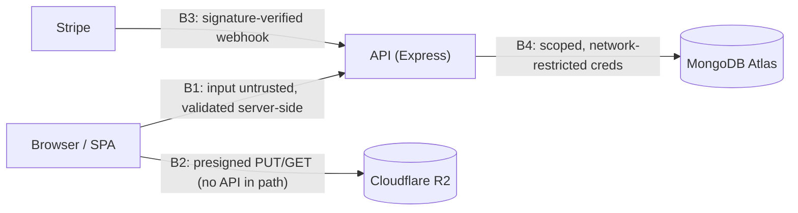

# 06 - Security / Threat Model

Security is the top design priority. Structured by **STRIDE** (Spoofing, Tampering,
Repudiation, Information disclosure, Denial of service, Elevation of privilege) walked
against the trust boundaries below. Each threat names a concrete attack on *this* system
and the mitigation built for it. Most mitigations were designed into docs 03-05; this doc
collects them and exposes residual risk.

## 1. Trust Boundaries

Data flow (from `03`) crosses four boundaries where trust changes:

- **B1 Browser → API** - all client input is untrusted; validated/authorized server-side.
- **B2 Browser → R2** - direct video transfer via presigned URLs (no API in the path).
- **B3 Stripe → API webhook** - inbound money events; authenticity by signature, not session.
- **B4 API → Atlas** - scoped DB credentials; network-restricted.

Card data never crosses our boundaries - it lives entirely inside Stripe Checkout.

## 2. STRIDE

### S - Spoofing (authentication)
- *Impersonating a user / forging a session.* → Opaque server-side session IDs stored in
  Mongo (not guessable, not JWT-decodable); cookie is `httpOnly` (JS can't read it, so XSS
  can't steal it) + `Secure` (HTTPS only). Passwords bcrypt-hashed (FR-6). **Session is
  regenerated on login** to prevent session fixation. Logout and admin-deactivate
  (`isActive=false`) invalidate the session server-side immediately.
- *Credential stuffing / brute force on login.* → Per-IP rate limiting on auth routes (NFR-6).
- *Forged payment event* - attacker POSTs a fake `checkout.session.completed` to grant
  themselves enrollment. → **Stripe signature verification** against the webhook secret,
  computed over the **raw request body** - so `POST /api/webhooks/stripe` is mounted with a
  raw parser **above `express.json`** (which would otherwise consume the stream and break the
  signature). Unsigned/invalid events are rejected (`400 WEBHOOK_SIGNATURE_INVALID`) before
  any DB write (FR-11, NFR-2). This is the single most important integrity control.

### T - Tampering (integrity)
- *Client tampers with price or pays less.* → Price is read from the **course record**
  server-side at checkout, never from the client, and **stamped into the Checkout Session
  metadata** as `expectedAmount`/`expectedCurrency`. The webhook re-validates
  `amount_total`/`currency` against **that snapshot** - not the live course record - before
  creating enrollment; a mismatch is logged (`PAYMENT_AMOUNT_MISMATCH`) and enrollment is
  skipped (fail-closed - a missing snapshot yields `NaN`, which never matches). Validating
  against the checkout-time snapshot is what blocks a tampered/underpaid charge from enrolling
  while still honoring a legitimate paid buyer whose course was re-priced by an admin
  mid-checkout (NFR-2).
- *Client forges enrollment* (skips payment). → Enrollment is written **only** by the
  signature-verified webhook; the client success page only *reads* state (FR-11).
- *Client elevates its own role / sets fields it shouldn't* (mass assignment). → Schema
  validation strips unknown fields; `role` is forced to `student` on signup and can only
  change via the admin route; never trusted from a request body (NFR-1, NFR-4).
- *Client sets a field it shouldn't (self-declared completion).* → The client **cannot set
  `completed`** - it posts only `{ positionSeconds }`, and the server derives completion
  itself (**≥95%**, sticky), ignoring any client-supplied `completed` flag (NFR-4).
  Completion is inferred from the reported position, so an enrolled user could over-report
  progress on **their own** lessons - this affects only their own progress display (no
  access, payment, or cross-user impact), so it is accepted.
- *Tampering in transit.* → TLS on every hop (static host, API host, R2, Stripe).
- *NoSQL (operator) injection* - an attacker smuggles a query operator into a field,
  e.g. POSTing `{"email": {"$ne": null}}` to a login body to match any user. → Schema
  validation rejects unexpected types (a field typed `string` rejects an object);
  Mongoose typed schemas cast input; `express-mongo-sanitize` strips keys containing `$`
  or `.` from request payloads so operators never reach the query. There is no string-built
  query / SQL, so classic SQL injection does not apply (NFR-4).

### R - Repudiation (non-repudiation)
- *User denies a purchase.* → Each enrollment stores `stripeSessionId`, `amountPaid`,
  `currency`, and timestamp (`04`), cross-referable to Stripe's own immutable record.
- *Dispute over account actions.* → Auth events and admin mutations are logged
  server-side (no PII/secrets in logs). Full audit logging is out of scope for v1 but the
  payment trail - the one that matters for money - is retained.

### I - Information Disclosure (confidentiality)
- *Paid video via a public or guessable URL.* → R2 bucket is **private** (no public
  access); video is served only via a **per-request presigned GET, ~1 h TTL**, minted
  after the enrollment check; `videoKey` is **never** returned in any API response;
  preview lessons are the sole exception (NFR-3, FR-17). This is the content-protection core.
- *Secrets leaking* (Stripe/R2 keys, session secret, DB URI). → Env-only config on
  the hosting platforms; `.env` git-ignored; never in the client bundle; R2 keys scoped to the
  bucket; Stripe keys are test-mode (NFR-5).
- *User enumeration* via auth responses. → Login/signup return **generic** failure
  messages that don't reveal whether an email exists.
- *Internal detail in errors.* → Consistent `{ error: { code, message } }` shape; stack
  traces and secret-bearing text never reach the client.
- *PII/passwords in logs.* → Passwords never logged; bcrypt only; request logging excludes
  bodies on auth routes.

### D - Denial of Service (availability)
- *Flooding auth endpoints.* → Rate limiting (NFR-6).
- *Large uploads exhausting the API.* → Video bytes go **direct to R2** via presigned PUT;
  the API never buffers the heaviest payload (AD-4), so the obvious resource-exhaustion
  vector bypasses the server entirely.
- *Oversized request bodies.* → Express body-parser `limit` rejects large JSON payloads
  (the legit large payload - video - never hits the API; it goes direct to R2).
- *Expensive queries.* → All hot paths are indexed (`04`).
- *Volumetric / L7 flooding.* → **Cloudflare** fronts the bandwidth-heavy R2 path and can
  front the API domain, providing network-layer DDoS absorption ahead of the single
  origin.
- *Security headers.* → `helmet` sets standard headers (HSTS, no-sniff, frame options,
  CSP - see §3) (NFR-6).
- *Residual:* single API instance, no WAF/HA in v1 - accepted at launch scale (`09` risks
  in `03`).

### E - Elevation of Privilege / Broken Access Control (authorization · OWASP A01)
- *Student reaches admin routes.* → `requireAdmin` middleware on every management route;
  role checked server-side from the session, `403` on failure (FR-9, NFR-1). The RBAC
  matrix in `05 §4` is the audit of this.
- *IDOR - reading another user's data* (progress, enrollments, `learning/overview`). → Every
  per-user query - including the `GET /api/learning/overview` aggregate - is scoped to
  `req.user._id` **from the session**, never a client-supplied `userId`. No "fetch my data"
  endpoint accepts a user identifier from the client.
- *IDOR - reconciling another user's checkout* via `GET /api/checkout/:sessionId/status`.
  → The endpoint asserts the retrieved session's `metadata.userId` matches the session caller
  before returning any status; a mismatch is `403 UNAUTHORIZED_ACCESS`, so a guessed
  `sessionId` can't leak another buyer's purchase or trigger their enrollment.
- *Watching a paid lesson without enrolling.* → `playback-url` (`optionalAuth`) mints a
  signed GET only after confirming `isPreview` or an enrollment row for
  `{session user, lesson.courseId}`; a paid lesson without a session is `401`, without an
  enrollment `403` (FR-17). **Anonymous preview is intentional** - a preview lesson on a
  **published** course plays for a logged-out visitor, and admins bypass. A
  **draft/unpublished** course returns `404` to non-admins, so gating leaks no course
  existence.

## 3. Cross-Cutting Controls

- **CSRF:** the frontend and API are served from **independent origins**, so the session
  cookie is `SameSite=None; Secure` (required for the browser to send it cross-site) - which
  means `SameSite` cannot be the CSRF control here. The **primary defense is an
  `Origin`/`Referer` guard** (`verifyRequestOrigin`, `middlewares/csrf.middleware.ts`): every
  state-changing request (any method but `GET`/`HEAD`/`OPTIONS`) must carry an `Origin` (or,
  failing that, a `Referer`) whose origin matches the configured `APP_ORIGIN`, else it is
  rejected `403 CSRF_ORIGIN_MISMATCH` before any handler runs. A forged cross-site `fetch` or
  form POST from a browser always sends a foreign `Origin` and is blocked. With **neither**
  header the guard **fails closed for authenticated requests**: one carrying a session cookie
  is rejected (a browser always sends an `Origin` on a mutation, so a cookie-bearing request
  without one is treated as forged), while one with no session cookie is a non-browser caller
  with nothing to forge and is allowed. The Stripe webhook is exempt - it is mounted above the guard and authenticated
  by signature, not a session. No CSRF token plumbing. (Local dev is same-origin over
  `localhost`, so the cookie is `SameSite=Lax` there.)
- **CORS:** locked to the single frontend origin with `credentials: true`; no wildcard.
- **XSS:** React escapes output by default and `dangerouslySetInnerHTML` is avoided
  (reflected XSS). **Stored XSS** - admin-entered course/lesson text is rendered to
  students, so it is sanitized on input (strip/encode HTML) before storage. The
  `httpOnly` session cookie means even a successful XSS cannot read the session, and CSP
  (below) is the backstop.
- **Content Security Policy:** explicit `helmet.contentSecurityPolicy` policy -
  `default-src 'self'`; `script-src 'self'`; `style-src 'self'`; `img-src 'self'` + the
  R2/Cloudflare media host; `media-src 'self'` + the R2/Cloudflare host (so signed-URL
  video plays); `connect-src 'self'` + the API origin; `frame-ancestors 'none'`
  (clickjacking); `object-src 'none'`. Tuned to allow our own media hosts and nothing else.
- **Input validation:** schema validation at every route boundary; reject-on-failure (NFR-4).
- **Transport:** HTTPS everywhere; `Secure` cookies; HSTS via helmet.

### OWASP mapping (quick reference)

| Concern | Where handled |
|---|---|
| Broken Access Control (A01) | §2-E (RBAC, IDOR, playback gating) |
| Injection - NoSQL (A03) | §2-T (validation, mongo-sanitize); no SQL used |
| XSS (A03) | §3 XSS + CSP |
| CSRF | §3 (Origin/Referer guard; `SameSite=None` cross-site) |
| DDoS / availability | §2-D (rate limit, body limits, Cloudflare, direct-to-R2) |
| Security headers / CSP | §3 (helmet + explicit CSP) |

## 4. Residual Risks (accepted for v1)

- No HA / WAF / multi-region - single API instance; acceptable at launch scale.
- No 2FA / MFA - out of scope for v1; password + rate limiting only.
- Bot protection limited to rate limiting (no CAPTCHA).
- Audit logging is payment-focused, not exhaustive.

Each is a conscious scope decision (`01`), not an oversight - revisit if the platform
moves beyond launch scale.

## 5. Design Rationale - key decisions & why

The STRIDE section above pairs each threat with its mitigation. These are the load-bearing
security decisions the whole design rests on, in the same **choice → why → alternative** form
as the other docs.

### Access is granted only by a signature-verified payment message
- **Choice.** An enrollment is created only when Stripe sends a payment event whose signature we verify; the browser's success page only reads the result.
- **Why.** The browser can't be trusted - only Stripe's signed event proves a real payment happened. Every other payment guarantee assumes this check holds, which makes it the single most important control.
- **Alternative rejected.** Granting access when the browser lands on the success page - anyone could fake it by just visiting the URL.

### Paid video is protected by a check at hand-out time, not by secret URLs
- **Choice.** Videos live in a private store; each play mints a fresh, short-lived link, and the "is this person enrolled?" check runs when the link is created.
- **Why.** The protection comes from the enrollment check at hand-out, not from the link being secret. Even if a link leaks it expires quickly, and it was only ever issued to an enrolled viewer.
- **Alternative rejected.** A permanent public or hard-to-guess URL - one leak exposes the video forever, with no enrollment check in the way.

### CSRF is stopped by an origin check that fails closed
- **Choice.** Every state-changing request must come from our own site (its Origin/Referer must match); an authenticated request that can't prove this is rejected.
- **Why.** The site and API run on separate addresses, so the login cookie travels cross-site and the usual browser setting can't block CSRF - checking the origin does. "Fails closed" means a request we can't verify is refused, not waved through.
- **Alternative rejected.** Leaning on the cookie's SameSite setting (useless once it's cross-site) or adding CSRF tokens to every form (more plumbing for the same result).

### Login is a server-side session in an httpOnly cookie, not a token in the page
- **Choice.** Being logged in is a random id kept on the server, carried in a cookie that page JavaScript cannot read.
- **Why.** We can cancel a session instantly (logout, or an admin disabling the account), and even a successful script injection can't steal the login, because scripts can't read the cookie.
- **Alternative rejected.** A self-contained token kept in the page's storage - readable by injected scripts and impossible to cancel before it expires.

### The server, never the client, sets anything that grants power or money
- **Choice.** The server owns the sensitive fields: the role is forced to "student" at signup, completion is decided server-side, and the amount paid is checked against the price captured at checkout - none are taken from the request.
- **Why.** Anything the client can put in a request, the client can forge. Deriving these on the server removes a whole class of "just edit the request" attacks - privilege escalation, faked progress, underpayment.
- **Alternative rejected.** Trusting these fields from the request body - opens role escalation, faked completion, and underpaying for a course.
